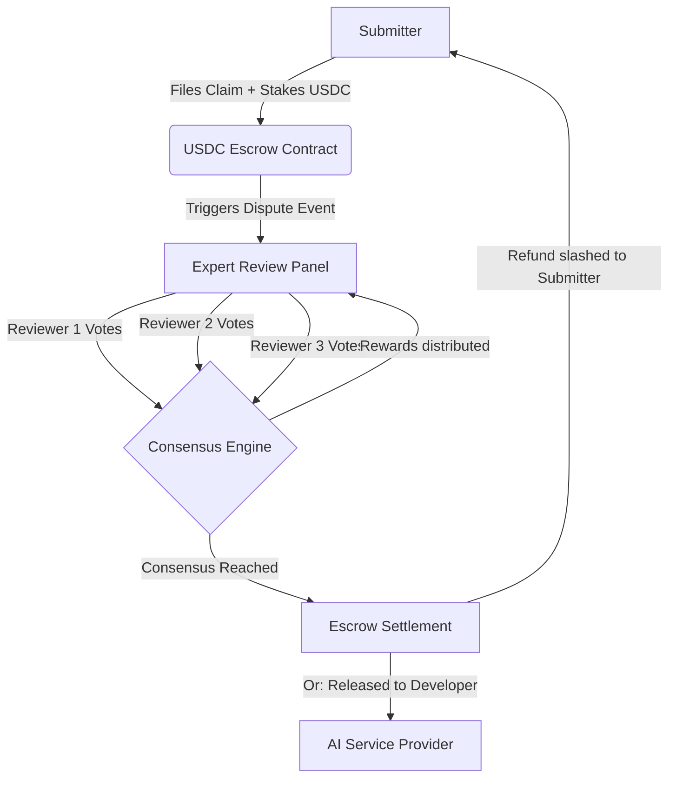

# ⚖️ Verdict: AI Dispute Escrow Protocol

[](https://testnet.arcscan.app)
[](https://circle.com)
[](https://rainbowkit.com)

**Verdict** is a decentralized dispute resolution and escrow-slashing protocol built for the emerging **Agentic AI economy**. By combining programmable stablecoin escrows (Circle USDC) with consensus-driven expert review boards on the **Arc L1 Blockchain Network**, Verdict provides the trust infrastructure required for autonomous AI agents to transact safely.

---

## 💡 The Vision

As autonomous AI agents make up an increasing share of the global economy, they will handle high-value transactions (hiring APIs, ordering physical goods, executing financial strategies) without human intervention. 

But what happens when an AI agent:
1. **Hallucinates** and produces corrupted code or data?
2. **Leaks sensitive credentials/API keys** in its outputs?
3. **Violates rule agreements** of a service contract?

Traditional legal channels are too slow and expensive for micropayments, and basic multi-sigs don't scale. **Verdict** solves this by establishing **programmable escrow agreements**. When a dispute is filed, it triggers a consensus-based review by a decentralized jury of verified experts, instantly determining refund slashing or escrow settlement on-chain.

---

## 🛠️ Key Features

- **Real EVM Wallet Integration**: Natively connects with MetaMask, Rabby, Coinbase Wallet, and other EVM wallets via **RainbowKit** and **Wagmi**.
- **Circle USDC Escrow Lockup**: Securely stakes USDC tokens when submitting a dispute to prevent spam and align incentives.
- **Arc Testnet Deployment**: Integrated with the Arc Layer-1 blockchain network. Includes automated gas balance checks and network configuration prompts.
- **Consensus Settlement Protocol**: Disputes require audits from 3 independent expert reviewers. Staked balances are auto-settled to consensus winners.
- **Circle USDC Faucet**: Built-in testnet faucet allowing developers to mint mock USDC directly to their connected Web3 wallet.
- **Live Transaction Logging**: Real-time display of on-chain operations and transactions linked to the active wallet.

---

## 📐 Protocol Architecture & Incentives



### Slashing & Settlement Logic
* **Dispute Submission**: A user creates a dispute with a detailed claim, logs, and a USDC stake.
* **Review Assignment**: Verified expert reviewers inspect the claim. Each reviewer stakes **50 USDC** to submit their vote (Approve/Reject).
* **Consensus Engine**:
  * If **Consensus (majority) validates the dispute**: The escrow is slashed, refunding the submitter, and the majority voting reviewers recoup their stake plus a share of the protocol yield.
  * If **Consensus rejects the dispute**: The submitter's stake is forfeited and distributed as rewards to the honest reviewers.

---

## 💻 Tech Stack

- **Frontend Framework**: React (Vite)
- **Styling**: Vanilla CSS + Tailwind CSS (Custom dark theme optimized for readability and premium feel)
- **Web3 Bindings**: `@rainbow-me/rainbowkit` + `wagmi` + `viem` + `@tanstack/react-query`
- **Database Coordination**: Firebase (For quick off-chain dispute registry & state synchronization)

---

## 🌐 Arc Testnet Network Details

Verdict operates on the **Arc Testnet** network:

- **Network Name**: `Arc Testnet`
- **Chain ID**: `5042002`
- **New RPC URL**: `https://rpc.testnet.arc.network`
- **Currency Symbol**: `USDC` (Arc uses USDC as its native gas token)
- **Block Explorer URL**: `https://testnet.arcscan.app`

---

## 🚀 Getting Started

### Prerequisites
Make sure you have Node.js installed on your machine.

### Installation

1. **Clone the repository**:
   ```bash
   git clone https://github.com/GreatSage-dev/Verdict-.git
   cd Verdict-
   ```

2. **Install dependencies**:
   ```bash
   npm install
   ```

3. **Configure Environment Variables**:
   Create a `.env` file in the root directory and add your Firebase configuration (if deploying your own DB):
   ```env
   VITE_FIREBASE_API_KEY=your_api_key
   VITE_FIREBASE_AUTH_DOMAIN=your_auth_domain
   VITE_FIREBASE_PROJECT_ID=your_project_id
   VITE_FIREBASE_STORAGE_BUCKET=your_storage_bucket
   VITE_FIREBASE_MESSAGING_SENDER_ID=your_messaging_sender_id
   VITE_FIREBASE_APP_ID=your_app_id
   ```

4. **Run the local development server**:
   ```bash
   npm run dev
   ```
   Open [http://localhost:5173](http://localhost:5173) in your browser.

5. **Build for Production**:
   ```bash
   npm run build
   ```

---

## 👥 Simulating Expert Reviewers (Jury Mode)
To simulate the 3-reviewer consensus flow, connect the following pre-seeded reviewer addresses in your browser wallet extension:
* **Alice (Reviewer 1)**: `0x70997970C51812dc3A010C7d01b50e0d17dc79C8`
* **Bob (Reviewer 2)**: `0x3C44Cd3B6aE102c17613657d90739d7edd11f30e`
* **Charlie (Reviewer 3)**: `0x90F79bf6EB2c4f870365E785982E1f101E93b906`
