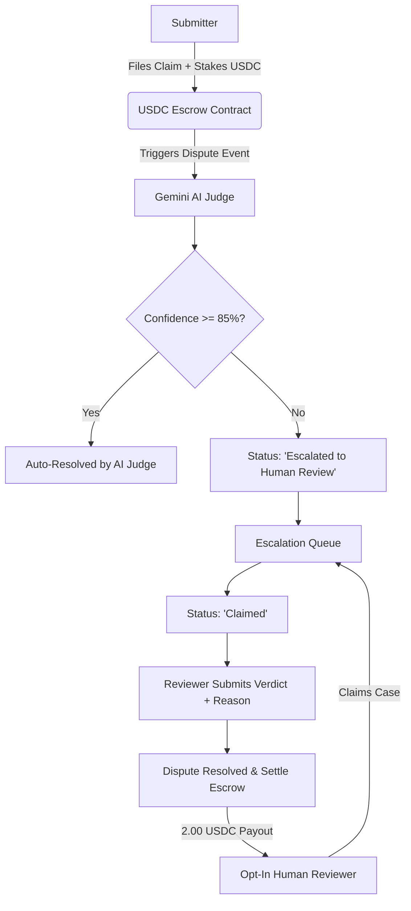

# ⚖️ Verdict: AI Dispute Escrow & Resolution Protocol

[](https://testnet.arcscan.app)
[](https://ai.google.dev)
[](https://circle.com)
[](https://rainbowkit.com)

**Verdict** is a decentralized dispute resolution and escrow-slashing protocol built for the emerging **Agentic AI economy**. By combining programmable stablecoin escrows (Circle USDC) on the **Arc L1 Blockchain Network** with real-time AI and human evaluation, Verdict provides trust infrastructure for autonomous AI agents to transact safely.

---

## 💡 The Vision

In the Agentic AI economy, autonomous agents handle high-value transactions (calling paid APIs, executing financial actions, procuring services) without human intervention. 

But what happens when an AI agent:
1. **Hallucinates** and produces corrupted code or data?
2. **Leaks sensitive credentials or API keys** in its outputs?
3. **Fails to align** with its prompt instructions?

Verdict establishes **programmable escrow agreements**. When a dispute is filed, it is first assessed by a single-pass AI Judge. If the AI Judge's confidence is low, the dispute is escalated to a queue of human reviewers. Reviewers audit the dispute, submit verdicts, and earn USDC rewards funded from the losing party's escrow.

---

## 📐 Protocol Architecture & Dispute Flow

Verdict features a hybrid AI-human tier resolution system:



### Dispute Progression States:
- **Pending**: Dispute is submitted and the USDC stake transaction is processed.
- **AI Judge Evaluation**: The system calls Google Gemini 2.0 Flash to evaluate the violation type, prompt, output, and evidence.
  - **Auto-Resolve (Confidence $\ge$ 85%)**: If the violation is clear-cut (e.g., credential leaks), the AI Judge auto-resolves the dispute, immediately releasing or refunding the escrow.
  - **Escalation (Confidence < 85%)**: If the dispute is ambiguous (e.g., subjective formatting alignment), the status changes to `escalated` and the case moves to the human queue.
- **Human Review**: A registered reviewer claims the case, reviews the evidence, submits their verdict (Approve/Reject) with justifications, and receives a flat **2.00 USDC** reward.

---

## 🛠️ Key Features

- **Gemini 2.0 Flash AI Judge**: Powered by Google Gemini to analyze evidence details and outputs with structured JSON schemas and automated confidence scoring.
- **No-Stake Reviewer Registration**: Any user can connect their Web3 wallet and opt in to become an active human reviewer (no token stake gate required).
- **Restricted Escalation Queue**: Active human reviewers gain exclusive access to a real-time queue showing only disputes marked as `Escalated to Human Review`.
- **EIP-3009 Nanopayments**: Interactive voting features utilize Circle's **EIP-3009** standard (`transferWithAuthorization`), enabling gasless off-chain signature authorization for sub-cent fee rails.
- **On-Chain Escrows**: Submitting disputes requires a real USDC smart contract transfer on the **Arc Testnet** to secure escrow funds.
- **Reviewer Earnings Dashboard**: Active reviewers can track their completed cases and withdraw their accumulated USDC rewards.

---

## 💻 Tech Stack

- **Frontend Framework**: React 18 (Vite)
- **Styling**: Vanilla CSS (sleek dark mode UI with ambient glows)
- **Web3 Bindings**: `@rainbow-me/rainbowkit` + `wagmi` + `viem` + `@tanstack/react-query`
- **AI Engine**: Google Gemini API REST client (`gemini-2.0-flash`)
- **Database Coordination**: LocalStorage (fallback) / Firebase

---

## 🌐 Arc Testnet Details

Verdict operates on the **Arc Testnet** network:

- **Network Name**: `Arc Testnet`
- **Chain ID**: `5042002`
- **RPC URL**: `https://rpc.testnet.arc.network`
- **Currency Symbol**: `USDC` (Arc uses USDC as its native gas token)
- **USDC Token Address**: `0x3600000000000000000000000000000000000000`
- **Block Explorer**: `https://testnet.arcscan.app`

---

## 🚀 Getting Started

### Installation

1. **Clone the repository**:
   ```bash
   git clone https://github.com/GreatSage-dev/Verdict-.git
   cd Verdict-
   ```

2. **Install dependencies**:
   ```bash
   npm install
   ```

3. **Configure Environment Variables**:
   Create a `.env` file in the root directory and add your Gemini API key:
   ```env
   VITE_GEMINI_API_KEY=your_gemini_api_key_here
   ```

4. **Run the local development server**:
   ```bash
   npm run dev
   ```
   Open [http://localhost:5173](http://localhost:5173) in your browser.

5. **Build for Production**:
   ```bash
   npm run build
   ```

---

## 🧪 Testing the Flows

### Path 1: Auto-Resolution (High Confidence)
1. Submit a dispute alleging **Security/PII Leak** (e.g., exposing an AWS Access Key in logs).
2. Attach a valid proof link or screenshot.
3. Sign the USDC stake transaction.
4. The AI Judge runs. Due to the high-severity category, confidence will score $\ge 85\%$, and the dispute will **auto-resolve** directly.

### Path 2: Human Escalation & Review (Low Confidence)
1. Submit a dispute alleging **Instruction Alignment** with weak or subjective evidence.
2. The AI Judge will score it with low confidence ($< 85\%$) and change the status to `escalated`.
3. Go to the **Become a Reviewer** tab and activate the reviewer role.
4. Open the **Escalation Queue** tab, click **Claim for Review**, and inspect the case.
5. Submit your verdict with detailed reasoning (minimum 50 characters).
6. The dispute resolves, and you receive **2.00 USDC** in your earnings profile.
